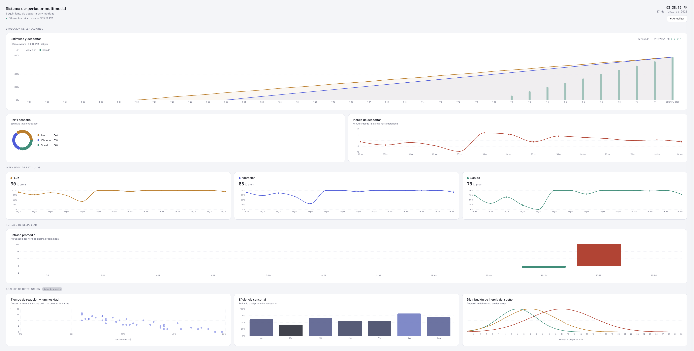

# Despertador multimodal — Visualización métricas

Panel de visualización para el sistema de alarma multimodal.

## Inicio rápido

```bash
npm install
npm run dev
```

Luego abre http://localhost:5173 en tu navegador.

## Contenido del dashboard

### Evolución de sensaciones
Gráfico principal del último evento registrado. Muestra las rampas de luz y vibración junto al volumen de sonido a lo largo del tiempo, con la hora en que se detuvo la alarma y el desfase respecto a la hora programada.

### Perfil sensorial
Gráfico de dona con la proporción de cada estímulo (luz, vibración, sonido) sobre el total entregado en los últimos 14 eventos.

### Inercia de despertar
Línea temporal con los minutos transcurridos entre la hora programada y la hora en que se detuvo la alarma, para los últimos 14 eventos.

### Intensidad de estímulos
Tres tarjetas (Luz, Vibración, Sonido) con el porcentaje promedio de cada estímulo y su tendencia histórica.

### Retraso de despertar
Barras agrupadas en ventanas de 2 horas que muestran el retraso promedio de despertar según la hora de la alarma programada.

### Análisis de distribución *(datos de muestra)*
Tres gráficos exploratorios generados con datos sintéticos:
- **Tiempo de reacción y luminosidad** — dispersión del retraso vs. lectura de luz (LDR).
- **Eficiencia sensorial** — estímulo promedio necesario por día de la semana.
- **Distribución de inercia del sueño** — curvas de distribución del retraso por franja horaria.

## Visualización



## Estructura del proyecto

```
despertador/
├── src/
│   ├── main.jsx             
│   ├── index.css             
│   ├── App.jsx               
│   ├── consts/
│   │   ├── data.js           
│   │   ├── tokens.js         
│   │   └── utils.js          
│   └── views/
│       ├── Charts.jsx        
│       ├── UI.jsx            
│       └── Clock.jsx
└── index.html
```

## Formato de los datos

```json
{
  "evento_id": {
    "hora_programada": "2024-03-15T07:00:00",
    "hora_parada":     "2024-03-15T07:08:30",
    "estimulos": {
      "luz":       85,
      "vibracion": 60,
      "sonido":    40
    },
    "mediciones": {
      "luz": 320
    }
  }
}
```
